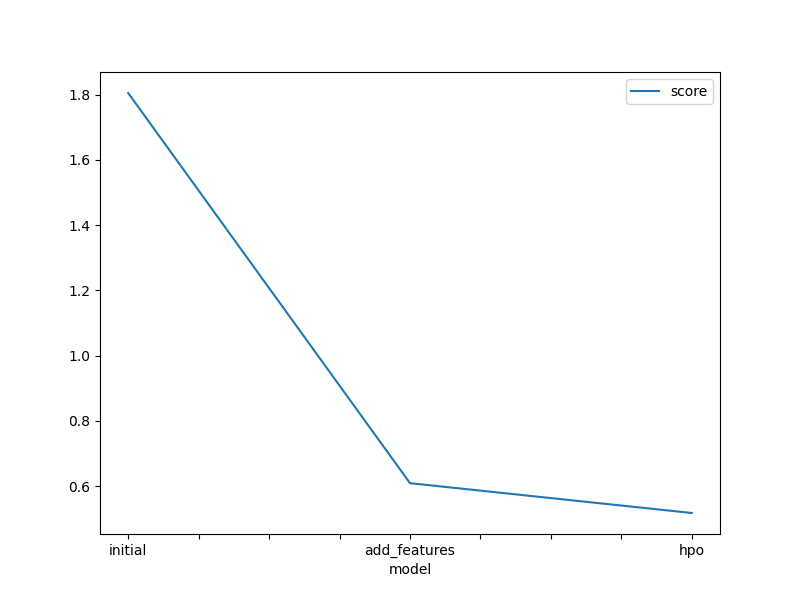

# Report: Predict Bike Sharing Demand with AutoGluon Solution
#### Rishabh yaduwanshi

## Initial Training
### What did you realize when you tried to submit your predictions? What changes were needed to the output of the predictor to submit your results?
when we tried to submit my predictions i found that there were 15 negative values in for the count field which means that the model was predicting negative number of bike count.which is impossible hence we turned those values into 0.

### What was the top ranked model that performed?
the hyperparamter tuned model with search strategy bayes optimizer is the highest performer 0.52311

## Exploratory data analysis and feature creation
### What did the exploratory analysis find and how did you add additional features?
the exploratorty anaylisis finds the data distribution for each column we plotted histogram for each column.we chose year month day and hour as the extra feature.as datetime column is in DateTime Format it was easy to just extrate these from it using df['datetime'].dt.__ where __ can be hour,year,day,month etc .

### How much better did your model preform after adding additional features and why do you think that is?
The model performed 60.58% better.This is because of the fact that additional featuers added were year,month,day and hour and we can see that hour and day play a cruicial role in exploratory analysis some hours are following same trends and so were days.Another reason the model performed better was specifying that season and weather are categorical data rather then a numeric value.
## Hyper parameter tuning
### How much better did your model preform after trying different hyper parameters?
The model performed 60.627% better after trying different paramters

### If you were given more time with this dataset, where do you think you would spend more time?
i would have spent more time analysing the datetime column seperatly and humdity temperature and windspeed seperatly to understand there effect on bike count.

### Create a table with the models you ran, the hyperparameters modified, and the kaggle score.
|model|search_strategy|time_limit|max_models|score|
|--|--|--|--|--|
|initial|auto|600|0|1.32863|
|add_features|auto|600|0|0.52374|
|hpo|bayes optimizer|600|0|0.52311|

### Create a line plot showing the top model score for the three (or more) training runs during the project.

<!--  -->

### Create a line plot showing the top kaggle score for the three (or more) prediction submissions during the project.

<!--  -->

## Summary
The goal to use the dateTime ,weather condition,effects of subscription,working days to find the need of bikes makes sense.So to findout which modle works best on this dataset we used autogluon.running the model without affecting hyperparamters much initially helps in understanding the current base we hold.Using the TabularPredictor allowed us to went through most possibilities.
after knowing the performance we added new features in the table and specified autogluon that season and weather are categorical value.after that we changed search strategy to bayes optimizer which gave us our highest performance 0.52311.
